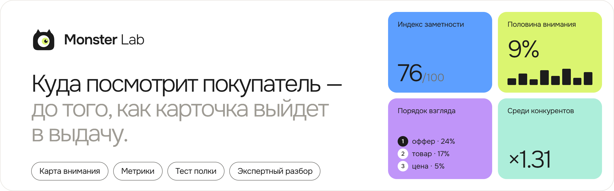
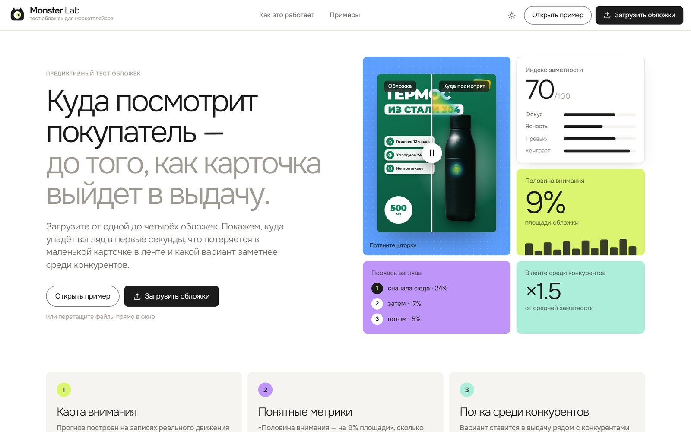
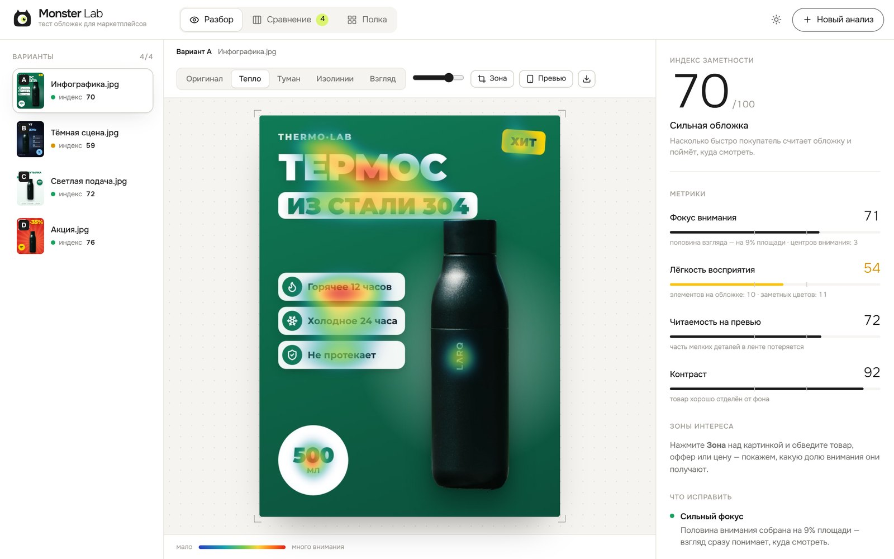
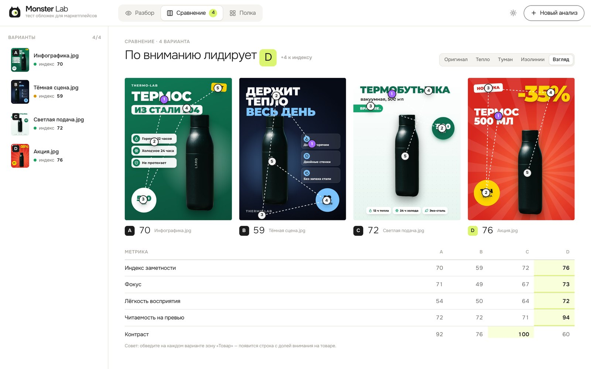

<div align="center">



**Предиктивный тест обложек для Wildberries и Ozon:** куда упадёт взгляд покупателя, что потеряется
в маленькой карточке в ленте и какой вариант заметнее среди конкурентов.

**Попробовать без установки: [monsterlab.hromovms.ru](https://monsterlab.hromovms.ru/)**

<a href="https://monsterlab.hromovms.ru/"></a>
<a href="#-быстрый-старт"></a>
<a href="docs/architecture.md"></a>
<a href="docs/deploy.md"></a>

[](https://github.com/Misha-Hromov-32/MonsterLab/actions/workflows/ci.yml)


</div>

<picture>
  <source media="(prefers-color-scheme: dark)" srcset="docs/images/landing-dark.jpg">
  
</picture>

## ✨ Что умеет

- 🔥 **Карта внимания** — нейросеть, обученная на записях реального движения глаз, показывает, куда посмотрят в первые секунды: тепло, туман, изолинии и порядок взгляда.
- 📏 **Понятные метрики** — «половина внимания на 9% площади», сколько элементов спорят за взгляд, прочитается ли текст в карточке шириной 170 px — и что исправить.
- 🛒 **Тест полки** — вариант ставится в выдачу рядом с конкурентами: заметят его или он сольётся.
- 🧑‍⚖️ **Экспертный разбор** — мультимодальные модели разбирают обложку как арт-директор и решают, на какой вариант скорее нажмут.
- 🪄 **Улучшенная обложка** — нейросеть перерисует обложку по выводам разбора: крупнее оффер, чище композиция, тот же товар.
- 🔎 **Конкуренты с Wildberries** — введите запрос, и тест полки возьмёт топ реальной выдачи.
- 🎯 **Вероятность выбора** — какой вариант скорее выберет покупатель, в процентах.
- 💳 **Подписка** — бесплатный тариф с лимитами и платный через ЮKassa.
- 🛠 **Админ-панель** — дизайн и тексты главной, свои примеры, ключ для экспертного разбора, цена и лимиты подписки.

<table>
<tr>
<td width="50%"></td>
<td width="50%"></td>
</tr>
</table>

## 🚀 Быстрый старт

Нужен [Docker](https://docs.docker.com/get-docker/) с Compose 2.24+.

```bash
git clone https://github.com/Misha-Hromov-32/MonsterLab.git && cd MonsterLab
cp .env.example .env          # задайте ADMIN_PASSWORD
docker compose up -d --build
```

Откройте **http://localhost:8080** и нажмите «Открыть пример». Первая сборка — 5–15 минут: скачиваются
PyTorch и веса нейросети. На слабом сервере поставьте `NEURAL=0` — соберётся лёгкий образ без нейросети.

Админ-панель — **http://localhost:8080/admin**. Экспертный разбор включается ключом [ProxyAPI](https://proxyapi.ru)
в админке, без ключа работает всё остальное.

## 📚 Документация

| | |
|---|---|
| [Как это работает](docs/architecture.md) | карта внимания, метрики и индекс, тест полки, устройство кода |
| [Деплой на сервер](docs/deploy.md) | Linux-сервер, HTTPS через Caddy, требования к памяти |
| [Настройки](docs/configuration.md) | все переменные окружения |
| [Участие в разработке](.github/CONTRIBUTING.md) | запуск без Docker, тесты, правила |

> [!IMPORTANT]
> Индекс заметности — инструмент для **сравнения вариантов одного товара между собой**, а не прогноз CTR:
> клики зависят ещё от цены, рейтинга и отзывов.

## 🙏 Благодарности

Карта внимания — [DeepGaze IIE](https://github.com/matthias-k/DeepGaze) (Linardos, Kümmerer, Press, Bethge,
[ICCV 2021](https://arxiv.org/abs/2105.12441)). Фото для примеров — [Unsplash](https://unsplash.com/license),
иконки — [Lucide](https://lucide.dev), шрифт — [Onest](https://fonts.google.com/specimen/Onest).

Код — [MIT](LICENSE).
