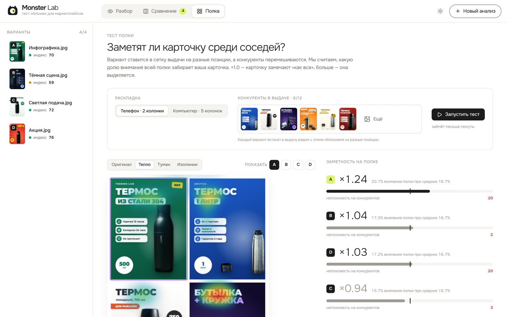
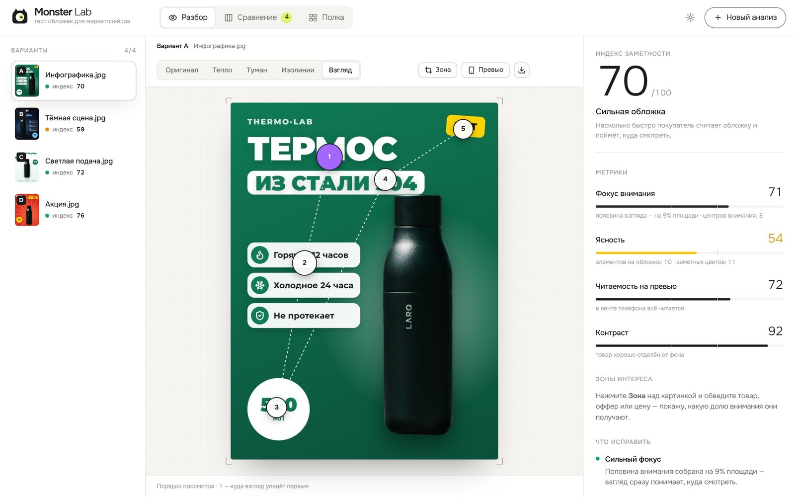
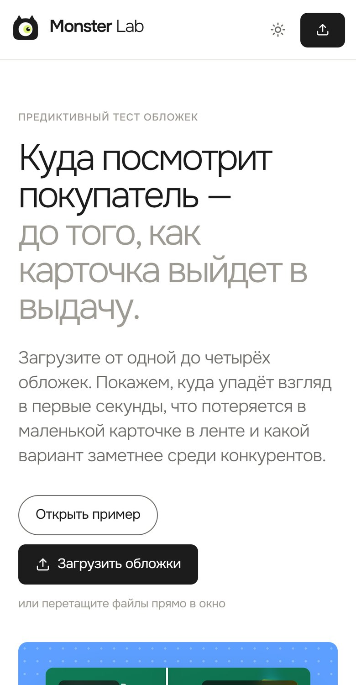
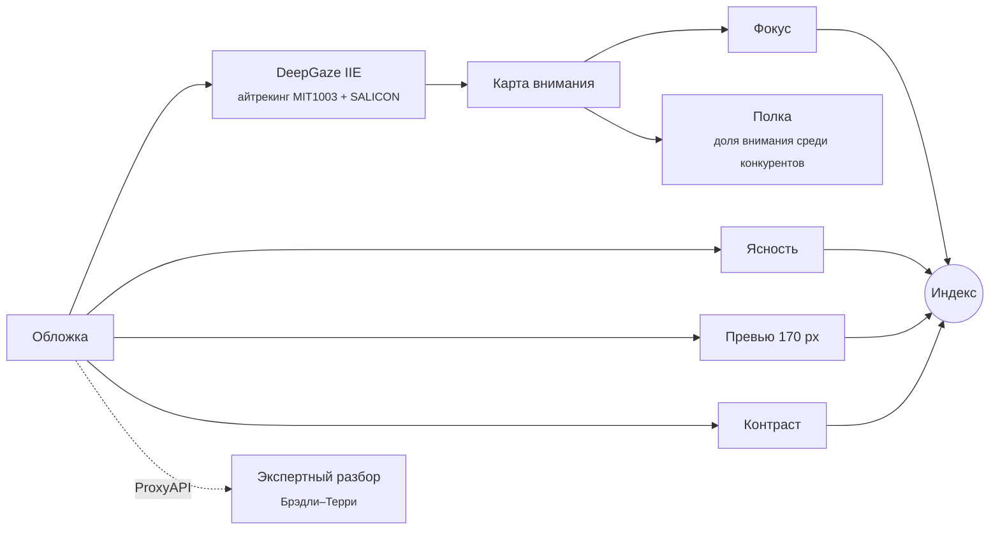

<div align="center">


<br>

**Предиктивный тест обложек для Wildberries и Ozon.** Загрузите до четырёх вариантов — и за несколько секунд
увидите, куда упадёт взгляд покупателя, что потеряется в маленькой карточке в ленте и какой вариант
заметнее среди конкурентов.

<br>

<a href="#-быстрый-старт"></a>
<a href="docs/architecture.md"></a>
<a href="docs/deploy.md"></a>
<a href="CONTRIBUTING.md"></a>

<br><br>

[](https://github.com/Misha-Hromov-32/MonsterLab/actions/workflows/ci.yml)


</div>

---

<picture>
  <source media="(prefers-color-scheme: dark)" srcset="docs/images/landing-dark.jpg">
  
</picture>

## ✨ Что умеет

<table>
<tr>
<td width="50%" valign="top">

### 🔥 Карта внимания
Нейросеть, обученная на записях реального движения глаз, показывает, куда посмотрят в первые секунды.
Четыре режима: **тепло**, **туман** (видно только замеченное), **изолинии** 25/50/75% внимания
и **порядок взгляда** — что заметят первым, вторым, третьим.

</td>
<td width="50%" valign="top">

### 📏 Понятные метрики
Не «магическая оценка», а величины с понятным смыслом: *«половина внимания — на 9% площади»*,
сколько отдельных элементов спорят за взгляд, прочитается ли текст в карточке шириной 170 px.
И выводы простыми словами: что мешает и как исправить.

</td>
</tr>
<tr>
<td valign="top">

### 🛒 Тест полки
Вариант ставится в сетку выдачи — телефон или компьютер — рядом с конкурентами на разные позиции.
**Заметность ×1,3** значит, что карточка забирает на 30% больше внимания, чем в среднем по полке.

</td>
<td valign="top">

### 🧑‍⚖️ Экспертный разбор
Мультимодальные модели разбирают обложку как арт-директор: что понятно за секунду, доверие,
премиальность, конкретные правки. А в режиме **«выбор покупателя»** попарно решают, на какую
карточку скорее нажмут.

</td>
</tr>
<tr>
<td valign="top">

### 🎯 Зоны интереса
Обведите товар, оффер или цену — и узнайте, какую долю внимания они получают и во сколько раз
это больше их доли площади.

</td>
<td valign="top">

### 🛠 Админ-панель
Три варианта дизайна главной, все тексты, свои примеры с конкурентами, ключ и модели для
экспертного разбора — без правки кода и перезапуска.

</td>
</tr>
</table>

## 📸 Как это выглядит

<table>
<tr>
<td width="50%"><p align="center"><sub><b>Разбор</b> — тепловая карта, индекс и что исправить</sub></p></td>
<td width="50%"><p align="center"><sub><b>Сравнение</b> — порядок взгляда на всех вариантах и таблица метрик</sub></p></td>
</tr>
<tr>
<td><p align="center"><sub><b>Полка</b> — заметность среди конкурентов в выдаче</sub></p></td>
<td><p align="center"><sub><b>Порядок взгляда</b> — куда посмотрят первым, вторым, третьим</sub></p></td>
</tr>
</table>

<details>
<summary>📱 На телефоне</summary>
<br>
<p align="center"></p>
</details>

## 🚀 Быстрый старт

Нужен только [Docker](https://docs.docker.com/get-docker/) с Compose 2.24+.

```bash
git clone https://github.com/Misha-Hromov-32/MonsterLab.git && cd MonsterLab
cp .env.example .env          # задайте ADMIN_PASSWORD
docker compose up -d --build
```

Откройте **http://localhost:8080** и нажмите «Открыть пример» — на главной уже есть четыре набора
обложек с конкурентами.

> [!NOTE]
> Первая сборка — 5–15 минут: скачиваются PyTorch и веса нейросети (~1,5 ГБ). Дальше сервис
> работает без интернета, кроме запросов экспертного разбора.

> [!TIP]
> Слабый сервер (до 1 ГБ памяти)? Поставьте `NEURAL=0` в `.env` — соберётся лёгкий образ без
> нейросети (~70 МБ памяти, анализ за доли секунды). Подробно — в [docs/deploy.md](docs/deploy.md).

**Админ-панель** — http://localhost:8080/admin. Если `ADMIN_PASSWORD` не задан, пароль сгенерируется
при первом запуске:

```bash
docker compose exec backend cat /data/admin_password.txt
```

**Экспертный разбор** включается ключом [ProxyAPI](https://proxyapi.ru) — в админке («Экспертный
разбор») или переменной `PROXYAPI_KEY`. Без ключа работает всё остальное.

## 🧠 Как это работает



| | Что считаем | Хорошо |
|---|---|---|
| **Фокус** | какая доля площади держит 50% внимания; штраф за каждую «горячую» зону сверх трёх | ≤ 4% площади |
| **Ясность** | число отдельных элементов и заметных цветов | 3 элемента, 7 цветов |
| **Читаемость на превью** | сколько деталей переживает уменьшение до 170 px — ширины карточки в мобильной выдаче | всё читается |
| **Контраст** | разброс яркости: отделён ли товар от фона | сочно, не плоско |

**Индекс заметности** = 0,35 · фокус + 0,25 · ясность + 0,25 · превью + 0,15 · контраст.

> [!IMPORTANT]
> Индекс — инструмент для **сравнения вариантов одного товара между собой**, а не прогноз CTR:
> клики зависят ещё от цены, рейтинга и отзывов.

Формулы, пороги, алгоритм полки и экспертного разбора — в [docs/architecture.md](docs/architecture.md).

## ⚙️ Настройки

Все переменные необязательны — [.env.example](.env.example) с комментариями.

<details>
<summary>Полный список</summary>

| Переменная | По умолчанию | Зачем |
|---|---|---|
| `ADMIN_PASSWORD` | генерируется | пароль админ-панели |
| `PORT` | `8080` | порт интерфейса на хосте |
| `PROXYAPI_KEY` | — | ключ экспертного разбора, если не задан в админке |
| `PROXYAPI_BASE_URL` | `https://api.proxyapi.ru/v1` | OpenAI-совместимый адрес |
| `EXPERT_MODELS` | `google/gemini-2.5-flash,anthropic/claude-haiku-4-5` | модели через запятую, до 6 |
| `EXPERT_CONCURRENCY` | `6` | одновременных запросов к моделям |
| `NEURAL` | `1` | `0` — образ без нейросети |
| `ENGINE` | `auto` | `classic` — не загружать нейросеть, даже если она есть |
| `DEEPGAZE_SIDE` | `768` | размер картинки для нейросети: больше — точнее и медленнее |
| `TORCH_THREADS` | `0` (авто) | потоков для нейросети |
| `BACKEND_MEM_LIMIT` | `1800m` | потолок памяти контейнера бэкенда |
| `MAX_UPLOAD_MB` | `25` | максимальный размер одного файла |
| `DATA_DIR` | `/data` в Docker, `backend/data` локально | где хранить настройки и примеры |
| `STATIC_DIR` | — | путь к собранному фронтенду: бэкенд отдаст его сам, без nginx |
| `TRUST_PROXY` | `1` в `docker-compose.yml` | верить `X-Real-IP` от nginx при подсчёте лимитов |
| `REAL_IP_FROM` | `127.0.0.1` (никому) | адреса внешнего HTTPS-прокси, которому nginx верит в `X-Forwarded-For` |

</details>

## 🧑‍💻 Разработка

```bash
# бэкенд без нейросети — быстро и без PyTorch
cd backend && python -m venv .venv && source .venv/bin/activate   # Git Bash на Windows: .venv/Scripts/activate
pip install -r requirements-dev.txt
ENGINE=classic uvicorn app.main:app --reload

# фронтенд с горячей перезагрузкой (в другом терминале)
cd frontend && npm ci && npm run dev      # http://localhost:5173
```

Проверки — те же, что в CI:

```bash
ruff check . && ruff format --check . && (cd backend && pytest)
(cd frontend && npm run format:check && npm test && npm run build)
```

Подробнее — в [CONTRIBUTING.md](CONTRIBUTING.md).

<details>
<summary>📁 Структура репозитория</summary>

```
monster-lab/
├── backend/                 FastAPI
│   ├── app/
│   │   ├── core/            алгоритмы: карта внимания, метрики, полка
│   │   ├── services/        настройки и примеры, загрузки, админка, экспертный разбор
│   │   └── api/             HTTP-роуты
│   ├── seed/                встроенные примеры обложек
│   ├── scripts/             entrypoint контейнера, загрузка весов
│   └── tests/               pytest
├── frontend/                Vue 3 + TypeScript + Vite
│   └── src/
│       ├── components/      рабочие экраны и главная (landing/)
│       ├── admin/           админ-панель (отдельный чанк)
│       └── lib/             отрисовка карт, типы, константы
├── tools/covers/            генератор встроенных обложек (Unsplash → rembg → HTML → Chrome)
├── docs/                    архитектура, деплой, картинки для README
└── docker-compose.yml
```

</details>

## 🙏 Благодарности

- **DeepGaze IIE** — A. Linardos, M. Kümmerer, O. Press, M. Bethge.
  [*DeepGaze IIE: Calibrated prediction in and out-of-domain for state-of-the-art saliency modeling*](https://arxiv.org/abs/2105.12441), ICCV 2021.
  Код и веса — [matthias-k/DeepGaze](https://github.com/matthias-k/DeepGaze).
- **Spectral Residual** — X. Hou, L. Zhang. *Saliency Detection: A Spectral Residual Approach*, CVPR 2007.
- Фотографии товаров для примеров — [Unsplash](https://unsplash.com/license), иконки — [Lucide](https://lucide.dev),
  шрифт — [Onest](https://fonts.google.com/specimen/Onest).

## 📄 Лицензия

Код — [MIT](LICENSE).
