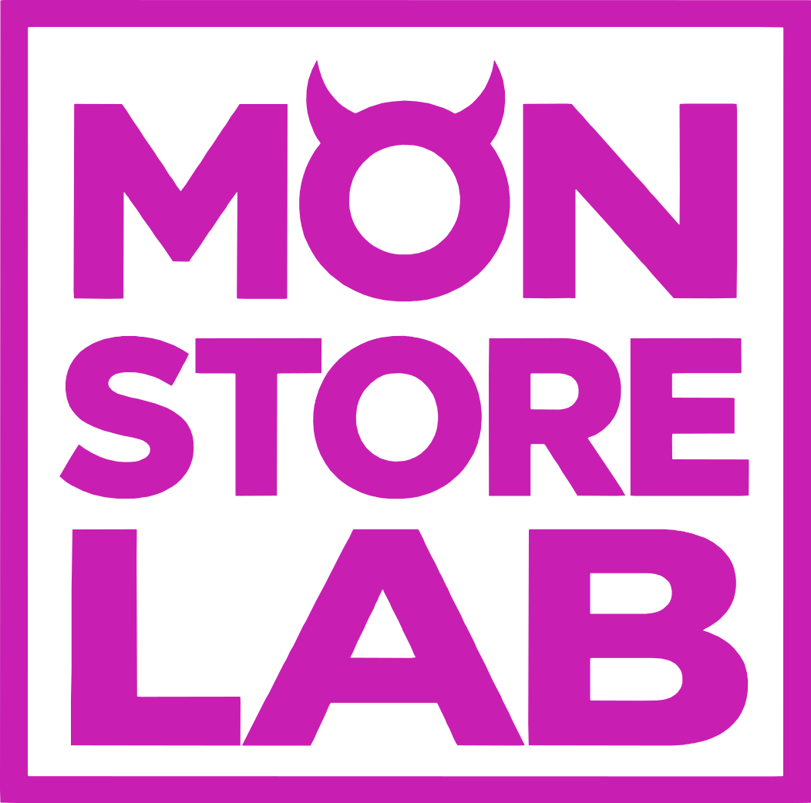

<div align="center">



### Проверка, сравнение и улучшение обложек

Карта внимания, разбор дизайна и генерация вариантов для Wildberries и Ozon.

<a href="https://monsterlab.hromovms.ru/"></a>
<a href="docs/operator-guide.md"></a>
<a href="docs/deploy.md"></a>

<br><br>

[](https://github.com/Misha-Hromov-32/MonsterLab/actions/workflows/ci.yml)


</div>

## Возможности

| | |
|---|---|
| **Карта внимания** | Прогноз просмотра, заметность, контраст и читаемость |
| **Сравнение** | До четырёх обложек рядом; прогноз выбора покупателя |
| **Конкуренты** | Поиск на Wildberries и тест заметности среди соседних карточек |
| **Разбор и генерация** | Замечания по дизайну и новый вариант обложки |
| **Личный кабинет** | Сохранение, открытие, скачивание и удаление обложек |
| **Тарифы и админка** | Лимиты функций, оплата, статистика и настройки сервиса |

## Интерфейс

<table>
<tr>
<td width="50%"></td>
<td width="50%"></td>
</tr>
<tr>
<td align="center"><b>Проверка обложки</b></td>
<td align="center"><b>Личный кабинет</b></td>
</tr>
</table>

[Главная страница](docs/images/landing.jpg) · [Сравнение вариантов](docs/images/compare.jpg) · [Тест полки](docs/images/shelf.jpg)

## Быстрый старт

Нужен Docker с Compose 2.24+. Команды для Linux и macOS:

```bash
git clone https://github.com/Misha-Hromov-32/MonsterLab.git
cd MonsterLab
cp .env.example .env
docker compose up -d --build
```

Сайт: **http://localhost:8080** · Админка: **http://localhost:8080/admin**

Настройки задаются в `.env`. Для писем нужен SMTP, для разбора и генерации — ключ ProxyAPI. Подробности: [установка](docs/deploy.md) и [настройки](docs/configuration.md).

## Документация

- [Инструкция по работе](docs/operator-guide.md)
- [Архитектура и метрики](docs/architecture.md)
- [Разработка и тесты](.github/CONTRIBUTING.md)

Оценки — прогноз, а не гарантия кликов или продаж. Сгенерированные варианты получают бонус к индексу; исходная оценка показывается отдельно.

Код — [MIT](LICENSE). Модель внимания — [DeepGaze IIE](https://github.com/matthias-k/DeepGaze). [Источники изображений](backend/seed/CREDITS.md).
