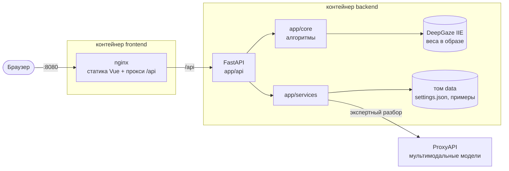

# Как устроен Monster Lab

## Общая схема



Наружу публикуется только nginx. Бэкенд работает одним процессом: нейросеть занимает 1,1–1,3 ГБ памяти,
и несколько воркеров просто скопировали бы её.

## Бэкенд — три слоя

```
backend/app/
├── main.py           точка входа: lifespan (загрузка нейросети, первый запуск), роутеры, статика
├── config.py         все переменные окружения — только здесь
├── errors.py         единый формат ошибок {"detail": {"code", "message"}}
├── ratelimit.py      ограничение частоты по IP
├── schemas.py        общие модели запросов
├── core/             алгоритмы — чистые функции над numpy, ничего не знают про HTTP
│   ├── imaging.py      декодирование, масштаб, кодирование сетки внимания
│   ├── saliency.py     DeepGaze IIE и классический движок
│   ├── metrics.py      метрики, индекс, выводы простыми словами
│   └── shelf.py        тест полки
├── services/         состояние и внешний мир — без FastAPI, ошибки — доменными исключениями
│   ├── site.py         settings.json: тексты, примеры, встроенные примеры из seed/
│   ├── uploads.py      загруженные обложки в памяти (LRU, JPEG 1024 px)
│   ├── auth.py         пароль и HMAC-токены админки
│   ├── expert.py       экспертный разбор через ProxyAPI, рейтинг Брэдли–Терри
│   └── showcase.py     витрина главной (посчитанный пример, кэш)
└── api/              HTTP: валидация, лимиты, вызов нужного слоя
    ├── deps.py         чтение загрузок с лимитом размера, проверка токена админки
    ├── analysis.py     /api/health, /api/analyze, /api/shelf
    ├── expert.py       /api/expert/critique, /api/expert/compare
    ├── public.py       /api/public/site, /files, /showcase
    └── admin.py        /api/admin/*
```

Зависимости идут только сверху вниз: `api → services → core`. Поэтому алгоритмы легко
тестировать без сервера, а HTTP-слой — без нейросети (`ENGINE=classic`). Сервисы про HTTP
не знают: они бросают `ImageExpired`, `ExpertError`, `BadImage`, а в ответы API их превращают
`api/` и `errors.py`.

## Как считается карта внимания

1. Картинка уменьшается до 768 px по длинной стороне (`DEEPGAZE_SIDE`), очень узкие баннеры
   дополняются полями.
2. **DeepGaze IIE** ([Linardos et al., 2021](https://arxiv.org/abs/2105.12441)) — ансамбль сетей,
   обученный на записях реального движения глаз (MIT1003, SALICON). На выходе — логарифм
   плотности вероятности фиксации в каждой точке; сверху добавляется априорное смещение к центру кадра.
3. Если нейросети нет (лёгкий образ или сбой), работает классический движок: спектральный остаток
   (Hou & Zhang, 2007) на трёх масштабах + цветовой контраст «центр — окружение» в Lab.
4. Карта нормируется (сумма = 1) и уходит во фронтенд сеткой uint8 ~160 px, которую браузер
   раскрашивает сам: тепло, туман, изолинии, порядок взгляда.

## Метрики

| Метрика | Что измеряем | 0 → 100 |
|---|---|---|
| **Фокус** | минимальная доля площади, на которую приходится 50% внимания; −7 за каждую «горячую» зону сверх трёх | 22% площади → 4% |
| **Ясность** | 0,7 · элементы + 0,3 · цвета: число отдельных элементов (связные области контуров) и заметных цветов (ячейки гистограммы Lab 8×8×8, занимающие больше 0,8% кадра) | 16 элементов → 3, 22 цвета → 7 |
| **Читаемость на превью** | SSIM детализированных областей после уменьшения до 170 px — ширины карточки в мобильной выдаче | 0,45 → 0,85 |
| **Контраст** | RMS яркости в Lab | 0,08 → 0,28 |

**Индекс = 0,35 · фокус + 0,25 · ясность + 0,25 · превью + 0,15 · контраст.** Это эвристика для
сравнения вариантов одного товара между собой, а не прогноз CTR. Пороги откалиброваны на типичных
карточках маркетплейсов и вынесены в константы в начале `core/metrics.py`.

**Порядок взгляда** — жадный выбор пиков карты с «торможением возврата»: после каждой фиксации её
окрестность гасится гауссианой, и следующий пик ищется среди оставшегося.

## Тест полки

Вариант ставится в сетку выдачи (2 колонки как в приложении или 5 как на сайте) рядом с конкурентами
на 4 позиции (меньше, если карточек мало; на полке 6 карточек в телефоне и 10 на компьютере). Конкуренты
при этом сдвигаются по кругу, так что в прогонах побывают все, и результат не зависит от конкретного соседа. Для каждой раскладки считается доля внимания всей полки, которая приходится на карточку.

**Заметность на полке** = средняя доля / честная доля 1/N. ×1,0 — карточку замечают «как все», больше — выделяется.
Дополнительно — **непохожесть на соседей**: расстояние между «отпечатками» обложек (средний цвет,
разброс, насыщенность, детализация, гистограмма оттенков) относительно того, насколько соседи различаются
между собой.

Без конкурентов варианты соревнуются друг с другом: каждый побывает на каждой позиции.

## Экспертный разбор

Мультимодальные модели (по умолчанию Gemini 2.5 Flash и Claude Haiku 4.5) через
[ProxyAPI](https://proxyapi.ru) — OpenAI-совместимый шлюз.

- **Разбор обложки** — каждая модель отвечает строгим JSON: что поймёт покупатель за секунду,
  оценки 1–10 (понятность, доверие, премиальность, эмоция, читаемость), сильные стороны и конкретные
  правки. Оценки усредняются, разброс между моделями показывается.
- **Выбор покупателя** — попарные сравнения «на какую карточку вы скорее нажмёте». Каждая пара
  показывается в обоих порядках, чтобы погасить склонность моделей выбирать первую картинку.
  Итоговый рейтинг — модель Брэдли–Терри (MM-алгоритм) с весом по уверенности ответа.

## Фронтенд

Vue 3 + TypeScript + Vite, без UI-китов. Весь стейт — в `src/store.ts` (реактивный объект и функции),
запросы — `src/api.ts`, отрисовка карт — `src/lib/heat.ts` (canvas, кэш раскрашенной сетки на
каждую картинку и режим). Админка — отдельный чанк, грузится только на `/admin`.

Гонки учтены явно: анализ отменяется `AbortController`, если картинку заменили или удалили; сравнение
и полка сверяют «поколение» набора вариантов и не записывают устаревший результат.

## Данные

Всё изменяемое — в томе `data` (`DATA_DIR`):

```
data/
├── settings.json          тексты главной, примеры, настройки разбора, ревизии встроенных примеров
├── examples/<id>/*.jpg    картинки примеров (≤1600 px)
├── admin_password.txt     сгенерированный пароль, если ADMIN_PASSWORD не задан (права 0600)
└── .secret                ключ подписи токенов админки
```

Встроенные примеры лежат в образе (`backend/seed`) и раскладываются в том при первом запуске;
новая ревизия набора обновляет картинки, а пример, удалённый в админке, не возвращается.
