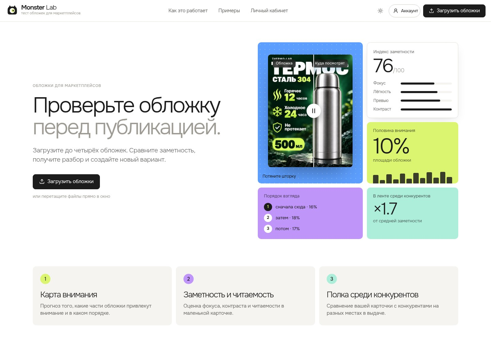
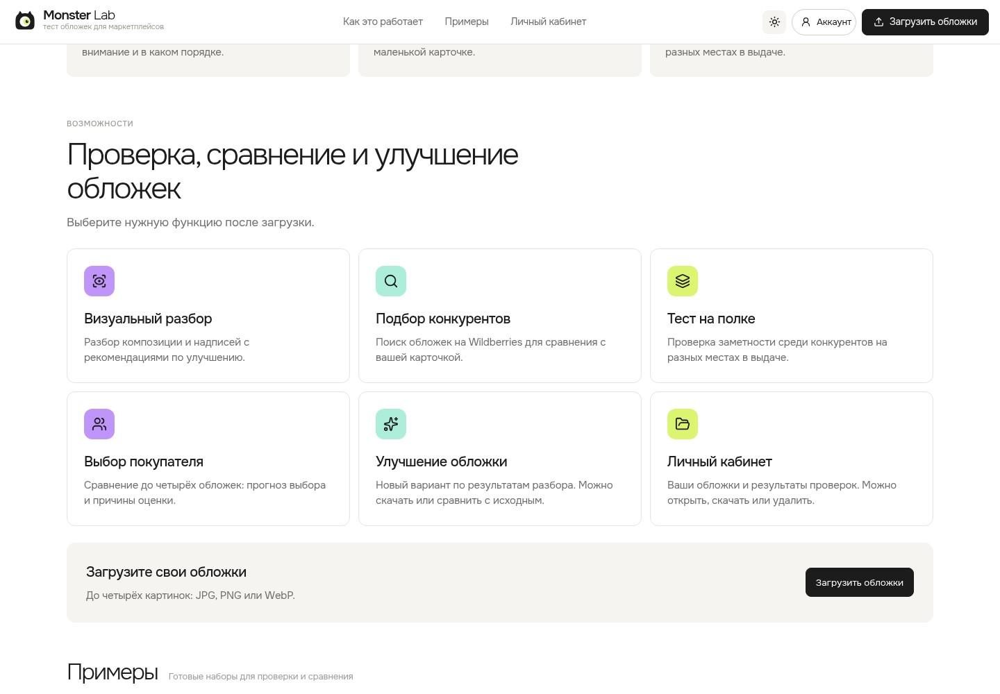
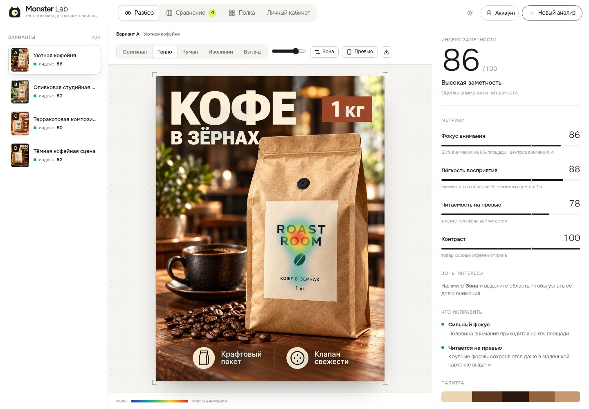
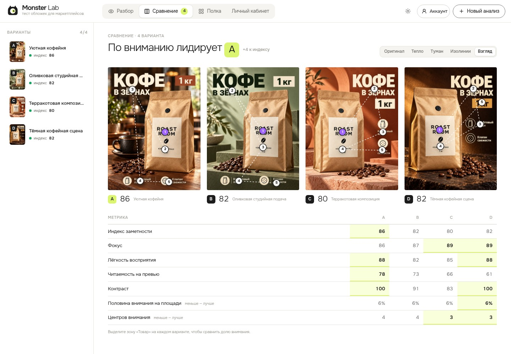
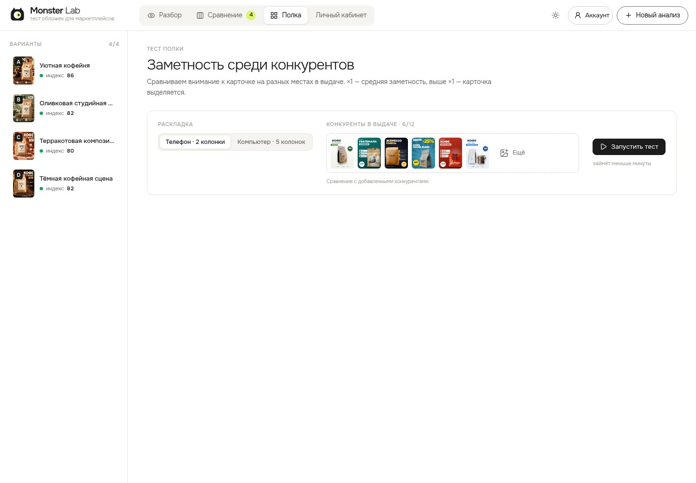
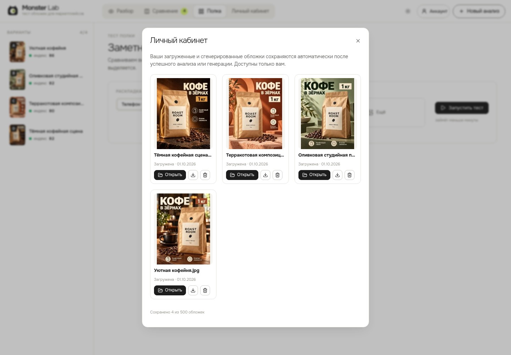

# MonStoreLab

## Аннотация

MonStoreLab — веб-приложение для проверки, сравнения и улучшения обложек карточек товаров. Руководство описывает работу пользователя, сообщения интерфейса и запуск собственной копии приложения.

## Содержание

1. [Назначение программы](#purpose)
2. [Условия выполнения программы](#requirements)
3. [Выполнение программы](#operation)
4. [Сообщения оператору](#messages)
5. [Приложение А. Установка и запуск](#installation)
6. [Приложение Б. Документация и лицензия](#references)

<a id="purpose"></a>
## 1 Назначение программы

### 1.1 Область применения

Программа предназначена для продавцов, дизайнеров и студий, которые готовят карточки товаров для Wildberries и Ozon. Пользователь загружает изображения, оценивает их заметность и сравнивает варианты одного товара.

### 1.2 Основные функции

**Таблица 1 — Функции программы**

| Функция | Результат |
|---|---|
| Проверка обложки | Карта внимания, порядок просмотра, индекс заметности, оценки фокуса, читаемости и контраста |
| Сравнение вариантов | Изображения и метрики до четырёх обложек рядом |
| Тест полки | Оценка заметности карточки среди соседних изображений на разных местах в выдаче |
| Подбор конкурентов | Поиск обложек по запросу в выдаче Wildberries |
| Визуальный разбор | Замечания по композиции, стилю и надписям; рекомендации по изменению обложки |
| Выбор покупателя | Прогноз выбора по попарному сравнению вариантов нейросетями |
| Улучшение обложки | Генерация нового варианта с возможностью скачивания и сравнения |
| Личный кабинет | Сохранение, открытие, скачивание и удаление обложек пользователя |
| Аккаунт и тарифы | Регистрация, подтверждение почты, восстановление пароля, просмотр лимитов и оплата |
| Администрирование | Статистика, настройка главной страницы, примеров, моделей и тарифов |

### 1.3 Ограничения оценок

Индекс заметности характеризует внимание и читаемость изображения. Он не является прогнозом CTR или продаж. Прогноз выбора покупателя формируется нейросетями и не заменяет исследование с участием людей.

Для сгенерированных вариантов применяется дополнительный бонус к индексу. Оценка без бонуса показывается отдельно. При сравнении следует учитывать обе величины.

Цена, аудитория и характеристики товара учитываются, если пользователь их указал. Сравнение с конкурентами требует добавленных изображений конкурентов.

<a id="requirements"></a>
## 2 Условия выполнения программы

### 2.1 Работа с опубликованным сервисом

Для работы необходимы подключение к интернету, современный браузер с JavaScript и подтверждённый аккаунт. Установка приложения на компьютер пользователя не требуется.

**Таблица 2 — Ограничения входных данных**

| Параметр | Значение |
|---|---|
| Форматы изображений | JPG, PNG, WebP |
| Размер файла | До 25 МБ при настройках по умолчанию |
| Варианты в рабочем наборе | До 4 |
| Обложки конкурентов | До 12 |
| Обложки в личном кабинете | До 500 на аккаунт |
| Доступные запуски функций | В соответствии с демо-доступом или выбранным тарифом |

### 2.2 Работа с собственной копией

Для установки используется Docker с Compose версии 2.24 или новее. Для полного образа рекомендуется сервер с 2 процессорными ядрами и 4 ГБ оперативной памяти. Требуемый объём диска зависит от образов и количества сохранённых обложек.

Для визуального разбора, выбора покупателя и генерации необходим настроенный ProxyAPI с доступом к моделям. Для отправки писем необходим SMTP. Для приёма оплаты необходимы настройки ЮKassa. Порядок установки приведён в приложении А.

<a id="operation"></a>
## 3 Выполнение программы

### 3.1 Вход в программу

1. Откройте [главную страницу](https://monsterlab.hromovms.ru/).
2. Нажмите «Войти». При первом посещении выберите регистрацию.
3. Укажите почту и пароль, ознакомьтесь с условиями и отметьте согласия.
4. Подтвердите почту по ссылке в письме.

На главной странице доступны описания функций и готовые примеры. Футер расположен после последнего блока страницы.



**Рисунок 1 — Главная страница**



**Рисунок 2 — Описание функций на главной странице**

### 3.2 Загрузка и проверка обложки

1. Нажмите «Загрузить обложки» или перетащите файлы в окно.
2. Выберите до четырёх изображений.
3. Дождитесь окончания проверки.
4. На вкладке «Разбор» выберите вариант и режим карты внимания.
5. При необходимости включите «Превью», чтобы посмотреть изображение в размере мобильной карточки.
6. Для оценки отдельной области нажмите «Зона» и выделите товар, надпись или другой элемент.

В правой части экрана отображаются индекс, метрики и замечания. Кнопка скачивания над изображением сохраняет карту внимания в PNG.



**Рисунок 3 — Проверка обложки и метрики**

### 3.3 Визуальный разбор и улучшение

1. Откройте нужный вариант на вкладке «Разбор».
2. При необходимости заполните «Данные о товаре». Эти поля необязательны.
3. Нажмите «Разобрать обложку» и дождитесь результата.
4. Для создания нового варианта нажмите «Улучшить обложку».
5. Скачайте результат или нажмите «Добавить как вариант» для сравнения с исходным изображением.

Если все четыре места заняты, выберите вариант для замены. Визуальный разбор и генерация расходуют соответствующие лимиты аккаунта.

### 3.4 Сравнение вариантов

1. Загрузите не менее двух обложек.
2. Откройте вкладку «Сравнение».
3. Сопоставьте карты внимания и значения в таблице.
4. Для прогноза выбора покупателя нажмите «Сравнить» в одноимённом блоке.

Для сравнения доли внимания к товару выделите зону «Товар» на каждом варианте.



**Рисунок 4 — Сравнение вариантов**

### 3.5 Тест полки и подбор конкурентов

1. Откройте вкладку «Полка».
2. Добавьте изображения конкурентов вручную или укажите запрос и нажмите «Найти на Wildberries».
3. Выберите раскладку и нажмите «Запустить тест».
4. Сравните заметность вариантов. Значение ×1 соответствует средней заметности для позиции; значение выше ×1 означает, что карточка выделяется.

Без конкурентов можно сравнивать собственные варианты между собой. Для запуска нужны два варианта либо один вариант и хотя бы один конкурент.



**Рисунок 5 — Обложки конкурентов и параметры теста полки**

### 3.6 Личный кабинет

1. Нажмите «Личный кабинет» в верхнем меню.
2. Выберите сохранённую обложку.
3. Нажмите «Открыть», чтобы вернуться к результату, либо используйте кнопки скачивания и удаления.

Обложки сохраняются после успешной проверки или генерации и доступны только владельцу аккаунта. Открытие сохранённого результата проверки не расходует лимит повторно. Повторное сохранение одинакового изображения не создаёт отдельную копию.



**Рисунок 6 — Личный кабинет демонстрационного аккаунта**

### 3.7 Тарифы и завершение работы

Нажмите кнопку аккаунта, чтобы посмотреть тариф и использованные лимиты. Для оплаты выберите «Выбрать тариф» или «Продлить или сменить тариф». Лимиты действуют в оплаченный период и не переносятся; при продлении срок суммируется.

Чтобы завершить работу, откройте окно аккаунта и нажмите «Выйти». Сохранённые обложки остаются в личном кабинете. «Новый анализ» очищает текущий рабочий набор.

<a id="messages"></a>
## 4 Сообщения оператору

**Таблица 3 — Сообщения и действия пользователя**

| Сообщение | Содержание и действие |
|---|---|
| «Войдите, чтобы проверить обложки» | Выполните вход или зарегистрируйтесь |
| «Сервис недоступен» | Повторите попытку позднее; для собственной установки проверьте состояние контейнеров |
| «Не удалось выполнить запрос. Попробуйте ещё раз.» | Повторите действие; при повторном сбое проверьте журнал бэкенда |
| «Сервер слишком долго не отвечает. Попробуйте ещё раз.» | Дождитесь восстановления сервиса и повторите действие |
| «Уже добавлены четыре варианта. Удалите или замените один из них.» | Освободите место в рабочем наборе |
| «Обложки не найдены. Попробуйте другой запрос.» | Измените запрос для поиска на Wildberries |
| «Здесь пока пусто. Загрузите и проверьте обложку.» | В личном кабинете ещё нет сохранённых обложек |
| «В кабинете уже 500 обложек. Удалите ненужные, чтобы сохранить новые.» | Удалите ненужные изображения из личного кабинета |

Если закончился лимит функции, программа открывает окно тарифов. Проверьте остаток лимита в окне аккаунта и выберите подходящий тариф.

<a id="installation"></a>
## Приложение А. Установка и запуск

### А.1 Первый запуск

Команды приведены для оболочки Linux или macOS. В Windows скопируйте `.env.example` в `.env` средствами PowerShell или проводника.

```bash
git clone https://github.com/Misha-Hromov-32/MonsterLab.git
cd MonsterLab
cp .env.example .env
```

Укажите настройки в `.env`: пароль администратора, публичный адрес, SMTP и необходимые интеграции. Мастер-ключ шифрования следует задать до первой регистрации и сохранить его резервную копию. Описание параметров находится в [документации по настройкам](configuration.md).

```bash
docker compose up -d --build
```

Веб-интерфейс: `http://localhost:8080`. Админ-панель: `http://localhost:8080/admin`.

Первая сборка загружает зависимости и веса модели. Для лёгкого образа без нейросети внимания задайте `NEURAL=0` в `.env` до сборки. Качество прогноза при этом отличается от полного образа.

Без SMTP ссылки подтверждения почты выводятся в журнал бэкенда. Для рабочей установки настройте отправку писем. Ключ ProxyAPI можно указать в админ-панели.

### А.2 Контроль, обновление и остановка

```bash
docker compose ps
docker compose logs -f backend
```

Обновление:

```bash
git pull
docker compose up -d --build
```

Остановка:

```bash
docker compose down
```

Пользовательские данные, обложки и настройки хранятся в томе `data`. Перед обновлением выполняйте резервное копирование. Команда `docker compose down` без параметра `-v` сохраняет том.

<a id="references"></a>
## Приложение Б. Документация и лицензия

**Таблица Б.1 — Документация проекта**

| Документ | Содержание |
|---|---|
| [Архитектура](architecture.md) | Модель внимания, метрики и устройство приложения |
| [Развёртывание](deploy.md) | Установка на Linux-сервере и настройка HTTPS |
| [Настройки](configuration.md) | Переменные окружения и интеграции |
| [Разработка](../.github/CONTRIBUTING.md) | Локальный запуск, тесты и правила внесения изменений |
| [Источники изображений](../backend/seed/CREDITS.md) | Происхождение обложек и изображений конкурентов |

Основные компоненты: Python 3.12, FastAPI, Vue 3, TypeScript, SQLite, Docker Compose. Прогноз внимания использует [DeepGaze IIE](https://github.com/matthias-k/DeepGaze); интерфейс — [Lucide](https://lucide.dev) и [Onest](https://fonts.google.com/specimen/Onest).

Код распространяется по лицензии [MIT](../LICENSE). У сторонних компонентов и изображений действуют собственные условия использования.

Скриншоты сняты с опубликованной версии 01.10.2026. Для рабочего интерфейса использован демонстрационный аккаунт и обложки из раздела «Примеры».
